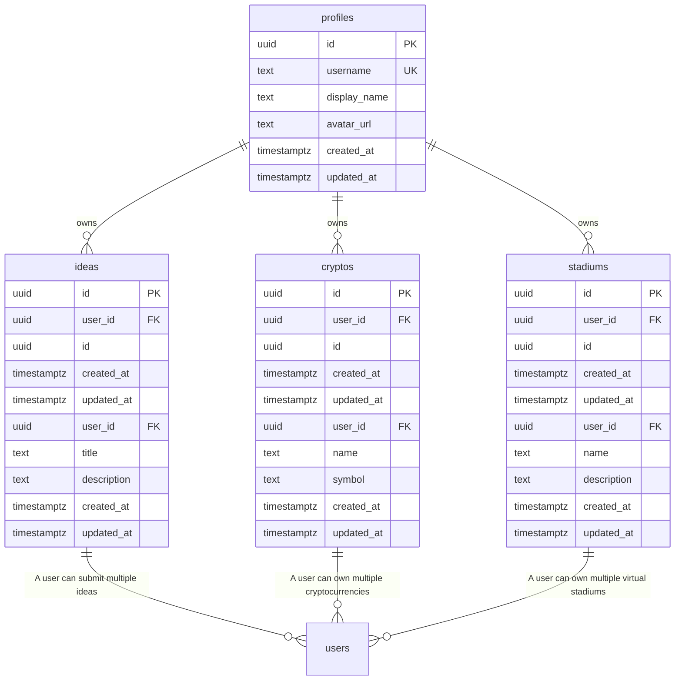

# Entity Relationship Diagram - Esports Hub

> **Auto-generated** from your idea analysis
> **Entities:** 3

---

## Visual Diagram

---

## Entity Details

### Idea
> A concept or proposal for a new digital collectible, prediction market, or AR-powered fantasy sports league

**Fields:**
  - `id`: uuid (required) - Primary key
  - `created_at`: datetime (required) - Creation timestamp
  - `updated_at`: datetime (required) - Last update timestamp
  - `user_id`: uuid (required) - Owner user ID
  - `title`: string (required)
  - `description`: text (required)

**Relationships:**
  - one_to_many → **User**: A user can submit multiple ideas

### Crypto
> A cryptocurrency used for transactions on the platform

**Fields:**
  - `id`: uuid (required) - Primary key
  - `created_at`: datetime (required) - Creation timestamp
  - `updated_at`: datetime (required) - Last update timestamp
  - `user_id`: uuid (required) - Owner user ID
  - `name`: string (required)
  - `symbol`: string (required)

**Relationships:**
  - one_to_many → **User**: A user can own multiple cryptocurrencies

### Stadium
> A virtual stadium where users can participate in AR-powered fantasy sports leagues

**Fields:**
  - `id`: uuid (required) - Primary key
  - `created_at`: datetime (required) - Creation timestamp
  - `updated_at`: datetime (required) - Last update timestamp
  - `user_id`: uuid (required) - Owner user ID
  - `name`: string (required)
  - `description`: text (required)

**Relationships:**
  - one_to_many → **User**: A user can own multiple virtual stadiums

---

## Notes

- All entities have standard fields: `id`, `user_id`, `created_at`, `updated_at`
- `PK` = Primary Key, `FK` = Foreign Key, `UK` = Unique Key
- Copy the Mermaid code block to visualize in any Mermaid-compatible tool
- Relationships: `||--o{` = one-to-many, `||--||` = one-to-one, `}o--o{` = many-to-many
